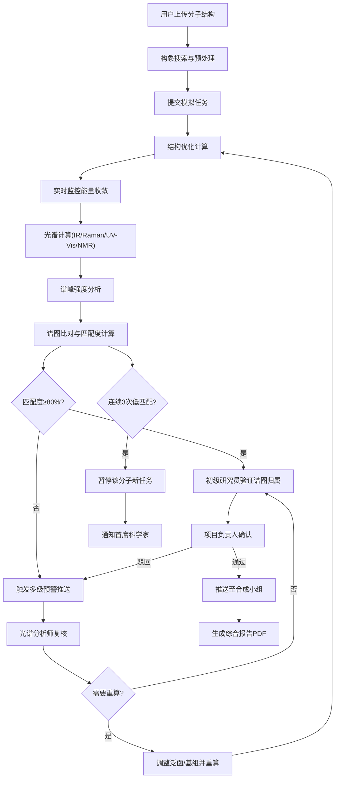

## 1. 产品概述

高精度分子光谱模拟与智能结构鉴定平台，支持分子结构文件上传、量子化学计算、多类型光谱预测、智能结构鉴定和审批流程管理。

- 解决实验室光谱分析效率低、人工鉴定误差大、计算资源调度难的问题
- 面向光谱分析师、合成化学家、科研人员和项目管理者

## 2. 核心功能

### 2.1 用户角色

| 角色 | 注册方式 | 核心权限 |
|------|----------|----------|
| 初级研究员 | 系统注册 | 上传分子、提交模拟任务、验证谱图归属 |
| 光谱分析师 | 系统注册 | 复核异常预警、调整计算参数、审核谱图 |
| 项目负责人 | 系统注册 | 确认结构合理性、审批鉴定结果 |
| 合成小组 | 系统注册 | 查看已批准的鉴定结果 |
| 首席科学家 | 系统注册 | 查看统计看板、管理暂停任务 |

### 2.2 功能模块

1. **工作台首页**: 任务概览、快捷操作、预警通知、统计卡片
2. **分子管理**: 分子库、结构上传(SMILES/XYZ)、3D可视化、构象搜索
3. **模拟任务**: 任务列表、状态流转、实时监控、参数配置
4. **光谱分析**: 多光谱叠加展示、峰位标注、振动模式动画、分子轨道分析
5. **智能推荐**: 泛函/基组/溶剂模型推荐、历史匹配度分析
6. **审批中心**: 两级审批流程、审批记录、意见反馈
7. **报告中心**: 综合报告生成、PDF导出、原始数据导出
8. **统计看板**: 完成率统计、准确度分析、资源消耗、性能趋势

### 2.3 页面详情

| 页面名称 | 模块名称 | 功能描述 |
|----------|----------|----------|
| 工作台 | 任务概览 | 显示各状态任务数量、今日完成、待审批、预警数 |
| 工作台 | 快捷操作 | 快速上传分子、新建模拟任务、查看报告 |
| 工作台 | 实时预警 | 展示匹配度低、异常振动模式的任务列表 |
| 分子管理 | 分子列表 | 分子式、SMILES、分子量、创建时间、操作列 |
| 分子管理 | 结构上传 | 支持SMILES文本输入、XYZ文件上传、实验光谱数据上传 |
| 分子管理 | 3D预览 | WebGL分子3D可视化、旋转缩放、构象选择 |
| 模拟任务 | 任务看板 | 按状态分列的看板视图、拖拽流转 |
| 模拟任务 | 任务详情 | 基本信息、计算参数、实时进度、能量收敛曲线 |
| 模拟任务 | 光谱计算 | 红外/拉曼/紫外-可见/NMR谱图展示、实验对比 |
| 光谱分析 | 谱图叠加 | 实测谱与计算谱叠加对比、匹配度评分 |
| 光谱分析 | 振动模式 | 振动模式动画播放、频率/强度/对称性展示 |
| 光谱分析 | 轨道贡献 | 分子轨道能级图、跃迁贡献分析 |
| 智能推荐 | 参数推荐 | 基于历史数据推荐最优泛函、基组、溶剂模型 |
| 审批中心 | 待审批列表 | 初级验证、负责人确认两级审批队列 |
| 审批中心 | 审批详情 | 谱图预览、鉴定意见、审批操作 |
| 报告中心 | 报告列表 | 已生成报告列表、预览/下载/删除 |
| 报告中心 | 报告生成 | 自定义报告内容、一键生成PDF |
| 统计看板 | 核心指标 | 模拟完成率、预测准确度、资源消耗卡片 |
| 统计看板 | 趋势图表 | 月度完成率趋势、准确度对比箱图 |
| 统计看板 | 资源监控 | 计算资源使用率、任务耗时分布 |

## 3. 核心流程

用户上传分子结构文件 → 系统自动构象搜索 → 提交模拟任务 → 结构优化计算 → 光谱计算 → 谱图比对 → 匹配度检查 → 匹配度≥80% → 初级研究员验证 → 项目负责人确认 → 推送合成小组 → 生成综合报告

匹配度<80%或异常振动模式 → 触发预警 → 光谱分析师复核 → 调整参数重算 → 记录调整日志

同一分子连续三次匹配度低 → 暂停新任务 → 通知首席科学家

## 4. 用户界面设计

### 4.1 设计风格

- **主色调**: 深邃科技蓝 (#0A2540) 搭配分子紫 (#6C5CE7) 作为强调色
- **辅助色**: 成功绿 (#00B894)、警告橙 (#FDCB6E)、危险红 (#FF7675)
- **背景**: 深色渐变背景，带有微妙的分子结构纹理
- **按钮风格**: 圆角胶囊按钮，带渐变和微发光效果
- **字体**: 标题使用 Space Grotesk，正文使用 Inter
- **布局**: 左侧固定导航 + 主内容区卡片式布局
- **图标风格**: 线性图标，带有科技感，光谱相关使用渐变填充

### 4.2 页面设计概述

| 页面名称 | 模块名称 | UI Elements |
|----------|----------|-------------|
| 工作台 | 任务概览 | 4列统计卡片，带渐变背景和悬浮动画 |
| 工作台 | 实时预警 | 带脉冲效果的预警列表，红色渐变边框 |
| 分子管理 | 3D预览 | 深色画布，分子球棍模型，光照效果 |
| 模拟任务 | 任务看板 | 6列状态看板，卡片拖拽，状态标签带色条 |
| 模拟任务 | 实时监控 | 能量收敛曲线图，实时数据点动画 |
| 光谱分析 | 谱图叠加 | D3.js交互式图表，双Y轴，可缩放平移 |
| 光谱分析 | 振动模式 | WebGL动画播放器，控制面板带进度条 |
| 审批中心 | 审批卡片 | 左右分栏，左侧谱图预览，右侧审批表单 |
| 统计看板 | 趋势图表 | ECharts图表，深色主题，动画过渡 |

### 4.3 响应性

- Desktop-first设计，支持1280px及以上分辨率
- 平板端(768-1279px): 导航折叠为图标模式，看板改为2列
- 移动端(<768px): 底部导航栏，卡片单列布局，图表简化

### 4.4 3D场景指导

- **分子3D预览**: 使用 WebGL + Three.js 渲染球棍模型
- **光照**: 三点光源系统，环境光 + 主方向光 + 补光
- **材质**: 原子使用金属质感材质，键使用半透明材质
- **交互**: 鼠标拖拽旋转、滚轮缩放、点击原子显示信息
- **动画**: 构象切换时平滑过渡，振动模式动画60fps
