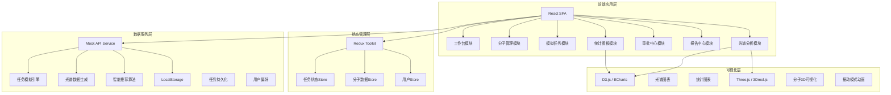
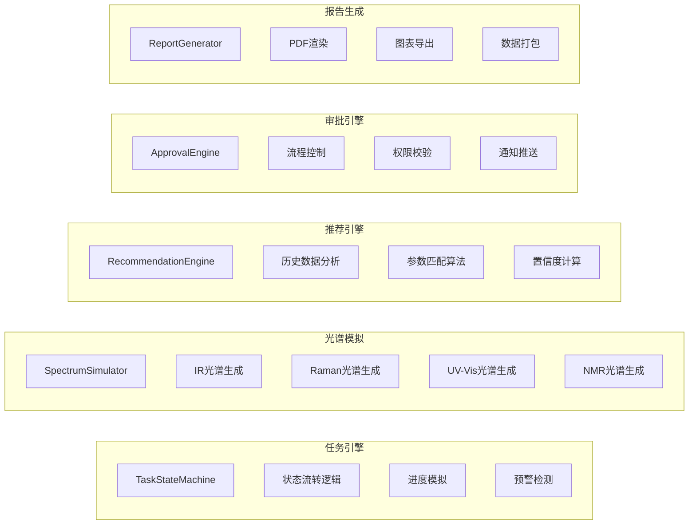
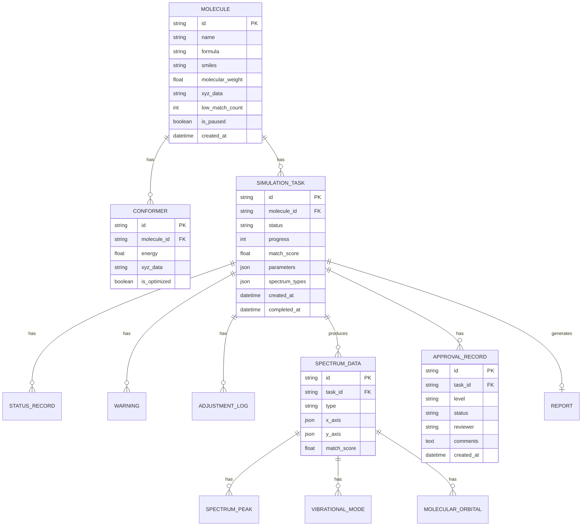

## 1. 架构设计



## 2. 技术描述

- **前端**: React@18 + TypeScript + Redux Toolkit
- **构建工具**: Vite@5
- **样式方案**: TailwindCSS@3 + CSS Variables
- **图表可视化**: ECharts@5 + D3.js@7
- **3D分子可视化**: 3dmol.js + Three.js
- **PDF生成**: jsPDF + html2canvas
- **路由**: React Router@6
- **UI组件库**: 自定义组件 + Headless UI
- **后端**: 无后端，使用Mock数据 + LocalStorage持久化
- **数据存储**: LocalStorage + IndexedDB (大体积光谱数据)

## 3. 路由定义

| Route | 页面 | 说明 |
|-------|------|------|
| / | 工作台首页 | 任务概览、快捷操作、预警通知 |
| /molecules | 分子管理 | 分子列表、结构上传、3D预览 |
| /molecules/:id | 分子详情 | 分子信息、构象列表、历史任务 |
| /tasks | 模拟任务 | 任务看板、任务列表、筛选搜索 |
| /tasks/:id | 任务详情 | 计算进度、光谱结果、实时监控 |
| /spectrum/:taskId | 光谱分析 | 谱图叠加、振动模式、轨道分析 |
| /approval | 审批中心 | 待审批列表、审批操作 |
| /reports | 报告中心 | 报告列表、生成、下载 |
| /dashboard | 统计看板 | 性能指标、趋势图表、资源监控 |
| /settings | 系统设置 | 参数配置、推荐引擎设置 |

## 4. API定义 (Mock)

```typescript
// 分子相关
interface Molecule {
  id: string;
  name: string;
  formula: string;
  smiles: string;
  molecularWeight: number;
  xyzData?: string;
  conformers: Conformer[];
  createdAt: Date;
  createdBy: string;
  isPaused: boolean;
  lowMatchCount: number;
}

interface Conformer {
  id: string;
  energy: number;
  xyzData: string;
  isOptimized: boolean;
}

// 任务相关
interface SimulationTask {
  id: string;
  moleculeId: string;
  moleculeName: string;
  formula: string;
  status: 'pending' | 'submitted' | 'optimizing' | 'calculating' | 'comparing' | 'completed' | 'error' | 'rollback';
  statusHistory: StatusRecord[];
  parameters: CalculationParameters;
  spectrumTypes: SpectrumType[];
  progress: number;
  energyConvergence: EnergyPoint[];
  matchScore?: number;
  warnings: Warning[];
  adjustmentLogs: AdjustmentLog[];
  createdAt: Date;
  createdBy: string;
  completedAt?: Date;
}

type SpectrumType = 'IR' | 'Raman' | 'UV-Vis' | 'NMR';

interface CalculationParameters {
  functional: string;
  basisSet: string;
  solventModel?: string;
  conformerId: string;
}

interface StatusRecord {
  status: string;
  timestamp: Date;
  note?: string;
}

interface EnergyPoint {
  step: number;
  energy: number;
  converged: boolean;
}

interface Warning {
  id: string;
  type: 'low_match' | 'abnormal_mode' | 'convergence_issue';
  severity: 'low' | 'medium' | 'high';
  message: string;
  reviewed: boolean;
  reviewedBy?: string;
  reviewedAt?: Date;
}

interface AdjustmentLog {
  id: string;
  timestamp: Date;
  adjustedBy: string;
  oldParameters: CalculationParameters;
  newParameters: CalculationParameters;
  reason: string;
}

// 光谱数据
interface SpectrumData {
  taskId: string;
  type: SpectrumType;
  xAxis: number[];
  yAxis: number[];
  peaks: SpectrumPeak[];
  experimentalData?: { xAxis: number[]; yAxis: number[] };
  matchScore?: number;
  vibrationalModes?: VibrationalMode[];
  molecularOrbitals?: MolecularOrbital[];
}

interface SpectrumPeak {
  position: number;
  intensity: number;
  assignment: string;
  isAbnormal?: boolean;
}

interface VibrationalMode {
  frequency: number;
  intensity: number;
  symmetry: string;
  displacementVectors: number[][];
  animationData: string;
}

interface MolecularOrbital {
  index: number;
  energy: number;
  symmetry: string;
  occupancy: number;
  contribution: { atom: string; percentage: number }[];
}

// 审批相关
interface ApprovalRecord {
  id: string;
  taskId: string;
  level: 'primary' | 'final';
  status: 'pending' | 'approved' | 'rejected';
  reviewer: string;
  comments: string;
  createdAt: Date;
  reviewedAt?: Date;
}

// 报告相关
interface Report {
  id: string;
  taskId: string;
  moleculeName: string;
  formula: string;
  createdAt: Date;
  createdBy: string;
  pdfUrl?: string;
  includeSections: string[];
}

// 智能推荐
interface Recommendation {
  functional: string;
  basisSet: string;
  solventModel?: string;
  confidence: number;
  historicalAccuracy: number;
  sampleCount: number;
}
```

## 5. 核心服务模块



## 6. 数据模型

### 6.1 ER图



### 6.2 初始数据

- 预置10个示例分子(苯、乙醇、乙酸、苯胺等)
- 预置20个模拟任务，覆盖各状态
- 预置光谱数据示例(IR、Raman、UV-Vis、NMR各类型)
- 预置审批流程示例数据
- 预置统计看板的历史数据(近6个月)
